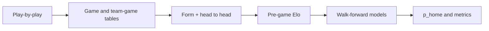
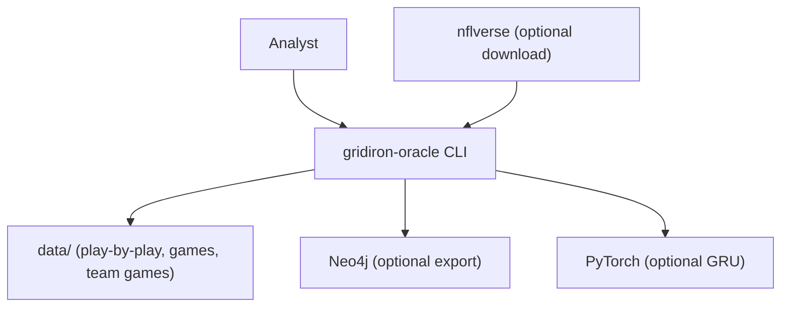
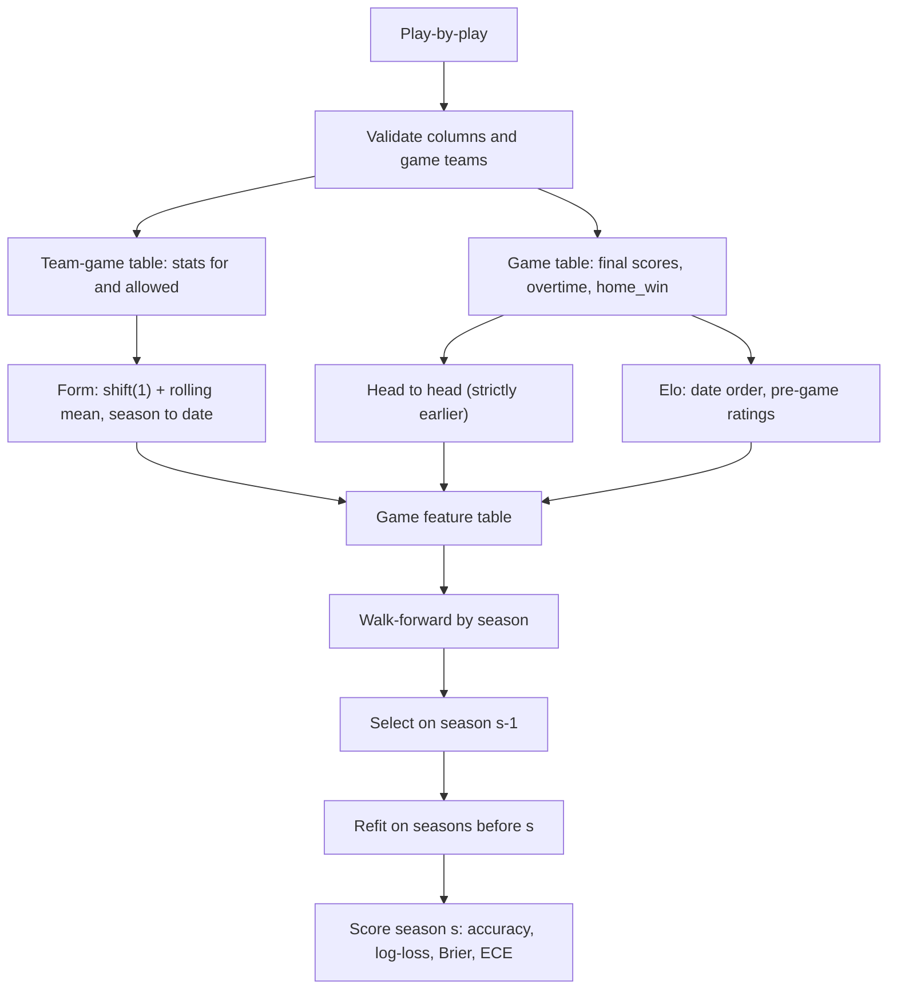

<div align="center">

# gridiron-oracle — NFL Game Predictions with Leak-Free Features and Elo

**gridiron-oracle is a forecasting pipeline for analysts who want honest NFL home-win probabilities. It takes play-by-play data through these steps to calibrated probabilities for each game:**

`aggregate by game_id` → `point-in-time form` → `pre-game Elo` → `walk-forward by season` → `log-loss, Brier, calibration`.


**[Summary](#1-summary)** ·
**[Workflow](#4-the-end-to-end-workflow)** ·
**[Run it](#10-how-to-run-gridiron-oracle)** ·
**[Configuration](#104-environment-variables)** ·
**[Known problems](#13-known-problems)** ·
**[Glossary](#15-glossary)**

</div>

> [!NOTE]
> This README uses ASD-STE100 Simplified Technical English. The writing rules and the project
> vocabulary are in [`docs/ste-style-guide.md`](docs/ste-style-guide.md). Each term in the
> [Glossary](#15-glossary) has only one meaning.

---

gridiron-oracle predicts the probability that the home team wins an NFL regular-season game.
Each feature uses only games that ended before kickoff, and the Elo engine records the rating of each team before each game.
The evaluation trains on earlier seasons, selects hyperparameters on the season before, and tests on the next season.
It reports log-loss, Brier score and calibration next to accuracy, against a home-team baseline and an Elo baseline.

This README is the **one location that explains all of gridiron-oracle**. It gives these topics:

- the general design
- each component and its procedure, step by step
- the decision rules
- the data map
- the runbook
- the validation results and the known problems

| If you are… | Read |
|---|---|
| A manager or reviewer | [1](#1-summary), [3](#3-design-rules), [4](#4-the-end-to-end-workflow), [12](#12-validation-results), [14](#14-key-points) |
| A developer who joins the project | All sections, in sequence. Keep [10](#10-how-to-run-gridiron-oracle) and [13](#13-known-problems) open while you work |
| An operator who runs gridiron-oracle | [10](#10-how-to-run-gridiron-oracle), then the section for the component that you use |

---

## Table of contents

1. 🧭 [Summary](#1-summary)
2. 🏗️ [How gridiron-oracle is built](#2-how-gridiron-oracle-is-built)
   - 2.1 [Components](#21-components)
   - 2.2 [System context](#22-system-context)
   - 2.3 [Repository layout](#23-repository-layout)
3. 🛡️ [Design rules](#3-design-rules)
4. 🔄 [The end-to-end workflow](#4-the-end-to-end-workflow)
   - 4.1 [Full flow](#41-full-flow)
   - 4.2 [The life cycle of one prediction](#42-the-life-cycle-of-one-prediction)
5. 🔵 [Aggregation of plays into games](#5-aggregation-of-plays-into-games)
6. 🟢 [Point-in-time features and Elo](#6-point-in-time-features-and-elo)
7. 🟣 [Models and walk-forward evaluation](#7-models-and-walk-forward-evaluation)
8. ⚖️ [The decision rules](#8-the-decision-rules)
9. 🗂️ [Data and file map](#9-data-and-file-map)
10. ▶️ [How to run gridiron-oracle](#10-how-to-run-gridiron-oracle)
    - 10.1 [Prerequisites](#101-prerequisites) · 10.2 [Installation](#102-installation) · 10.3 [Run gridiron-oracle](#103-run-gridiron-oracle) · 10.4 [Environment variables](#104-environment-variables)
11. 🧩 [How to extend gridiron-oracle](#11-how-to-extend-gridiron-oracle)
12. ✅ [Validation results](#12-validation-results)
13. ⚠️ [Known problems](#13-known-problems)
14. 📌 [Key points](#14-key-points)
15. 📖 [Glossary](#15-glossary)
16. 📄 [License](#16-license)

---

## 1. Summary

**The problem.** A pre-game forecast is only useful if it uses no information from the game itself or from later games. These questions are difficult:

- How do you change 450,000 plays into game rows without values on the wrong game?
- How do you compute team form and Elo with no look-ahead?
- How do you select models without using the test season?
- How do you know that a model is better than "always pick the home team" or plain Elo?
- Are the probabilities calibrated, or only the winners correct?

gridiron-oracle gives each of these questions its own component. Each component has unit tests, and several tests check for leakage.

| Item | Value |
|---|---|
| Input | Play-by-play CSV (nflverse columns) |
| Output | `p_home` for each game, per-season and pooled metrics, a calibration table |
| Components | **9** modules: config, synthetic, games, elo, features, models, sequence, graph, cli |
| Providers | nflverse data, Neo4j and PyTorch. All are optional |
| Offline mode | Synthetic play-by-play, all features, Elo, baselines, logistic regression and boosting. No download |
| Safety | No feature uses a game on or after the game date. Neo4j credentials come only from the environment |
| Tests | **20** pass in CI (`.[dev]` only) and 1 skips (`sequence` extra). With the `sequence` extra, all 21 pass |



---

## 2. How gridiron-oracle is built

### 2.1 Components

| Component | Module | Purpose |
|---|---|---|
| Settings | `src/gridiron_oracle/config.py` | Seed, window, Elo settings, Neo4j credentials as `SecretStr` |
| Synthetic league | `src/gridiron_oracle/synthetic.py` | Play-by-play of 32 synthetic teams with hidden strengths |
| Aggregation | `src/gridiron_oracle/games.py` | Game table and team-game table, merges on keys only |
| Elo engine | `src/gridiron_oracle/elo.py` | Date-ordered Elo with home advantage, margin multiplier, season regression |
| Features | `src/gridiron_oracle/features.py` | Form, season to date, head to head, Elo, differences |
| Models | `src/gridiron_oracle/models.py` | Baselines, logistic and boosting pipelines, walk-forward, metrics |
| Sequence model | `src/gridiron_oracle/sequence.py` | Optional GRU over each team's previous games |
| Graph export | `src/gridiron_oracle/graph.py` | Cypher script or push to Neo4j |
| CLI | `src/gridiron_oracle/cli.py` | The `gridiron-oracle` command with 6 subcommands |

### 2.2 System context



### 2.3 Repository layout

```
gridiron-oracle/
├── .github/workflows/ci.yml       # CI: Python 3.11, pip install -e ".[dev]", pytest -q
├── data/README.md                 # sources, licence, columns (data files are git-ignored)
├── docs/ste-style-guide.md        # writing rules and project vocabulary
├── src/gridiron_oracle/           # the 9 modules in 2.1
├── tests/                         # 21 unit tests (1 needs the sequence extra), synthetic data only
├── .env.example                   # variable names only
└── pyproject.toml                 # core deps: numpy, pandas, scikit-learn, pydantic. Extras: nflverse, neo4j, sequence, dev
```

---

## 3. Design rules

### 3.1 Merge on keys, never on position
`games.py` aggregates with `groupby("game_id")` and `groupby(["game_id", "posteam"])`. Every join is a merge on `game_id` and `team` with `validate="one_to_one"`. Each game must have exactly two team rows.

### 3.2 Only earlier games in a feature
Form features use `shift(1)` before `rolling`, so a game never sees itself. Head-to-head meetings need a strictly earlier date in both home and away directions. A test changes all results after a date and checks that no earlier feature changes.

### 3.3 Pre-game Elo in date order
`run_elo` sorts the games by date and stores the ratings before each game. The prediction of a game uses only those ratings. Neo4j is an export, not the engine.

### 3.4 All preprocessing inside the pipeline
Imputation, the constant-feature filter, scaling and `SelectKBest` are steps of an sklearn `Pipeline`. They are fit on the training seasons only.

### 3.5 Walk-forward with a separate validation season
For test season s, the models train on seasons before s − 1 and select hyperparameters by log-loss on season s − 1.
Then they refit on all seasons before s and predict season s. The test season never selects a model.

### 3.6 A binary target and proper scores
The target is `home_win` (1 = home win, 0 = away win). Ties are left out and counted. The report gives accuracy, log-loss, Brier score and expected calibration error, next to two baselines.

### 3.7 Credentials from the environment
`NEO4J_URI`, `NEO4J_USER` and `NEO4J_PASSWORD` come only from the environment. `Settings` keeps the password as a `SecretStr`.

---

## 4. The end-to-end workflow

### 4.1 Full flow



### 4.2 The life cycle of one prediction

1. Aggregate the plays of all games into the game table and the team-game table.
2. For each team, compute the form from the previous 8 games.
3. Compute the head-to-head values from earlier meetings.
4. Run Elo over all games in date order and keep the pre-game ratings.
5. Join home features, away features and Elo on `game_id`.
6. Select the hyperparameters on the season before the test season.
7. Refit the selected pipeline on all earlier seasons.
8. Predict `p_home` for each game of the test season.
9. Score the probabilities and compare them with the baselines.

---

## 5. Aggregation of plays into games

**Purpose.** Change plays into game rows and team-game rows with no misalignment.

| Input | Output |
|---|---|
| Play-by-play | Game table, team-game table |

**Procedure**

1. Check the required columns. Add the optional columns `week`, `touchdown`, `field_goal_result` and `penalty_yards` if they are missing.
2. Remove rows with no `posteam` (for example timeouts and end-of-quarter rows).
3. Fail if one `game_id` has more than one home team or away team.
4. For each game, take the maximum running scores as the final score. Set `overtime` = 1 if a play has `qtr` > 4.
5. For each game and offence team, sum scrimmage plays, yards, pass yards, rush yards, giveaways, third-down results and penalty yards.
6. Build one home row and one away row for each game. Merge the offence stats on `game_id` and `team`.
7. Merge the opponent's offence stats as `yards_allowed` and `takeaways`.

**Rules**

- `third_rate` = converted / (converted + failed). It is empty if the team had no third down.
- `win` is 1, 0 or 0.5 (tie) in the team-game table. `home_win` is empty for a tie.

---

## 6. Point-in-time features and Elo

**Purpose.** Describe each team as it was before kickoff.

| Feature group | Definition |
|---|---|
| `form_*` | Mean of the previous `window` games (default 8) of the team, all seasons |
| `std_*` | Mean of the earlier games of the same season |
| `form_games`, `rest_days` | Number of games in the window, days since the previous game |
| `h2h_games`, `h2h_margin` | Earlier meetings and their mean margin for today's home team |
| `elo_home_pre`, `elo_away_pre`, `elo_p_home`, `elo_diff` | Pre-game Elo values |
| `diff_*` | Home value minus away value for each form feature |

Stats in the form groups: points for, points against, yards, yards allowed, giveaways, takeaways, third-down rate, pass yards, rush yards and wins.

**Elo procedure**

1. Sort the games by date and `game_id`.
2. At the first game of a new season, move each rating one third of the way to 1505.
3. Give a new team the rating 1500.
4. Calculate the expected home score: 1 / (1 + 10^(−(home − away + 55) / 400)).
5. Store the pre-game ratings and the expected score.
6. Multiply K = 20 by the margin factor ln(|margin| + 1) × 2.2 / (0.001 × winner Elo lead + 2.2).
7. Add K × factor × (result − expected) to the home rating and subtract it from the away rating.

---

## 7. Models and walk-forward evaluation

**Purpose.** Give a home-win probability for each game and measure it fairly.

| Model | What it is | Hyperparameters (selected on the validation season) |
|---|---|---|
| `home-team` | The home-win rate of the training games, for every game | none |
| `elo` | `elo_p_home` | none |
| `logistic` | Imputer → constant filter → scaler → `SelectKBest(f_classif)` → logistic regression | k ∈ {10, 25, all}, C ∈ {0.01, 0.1, 1} |
| `boosting` | Histogram gradient boosting, 200 iterations, L2 1.0 | depth ∈ {2, 3}, learning rate ∈ {0.03, 0.1} |
| `gru` (optional) | Shared GRU over each team's last 8 games plus the Elo difference, early stopping on the validation season | fixed: hidden 16, Adam 3e-3 |

**Procedure for each test season s**

1. Drop ties. Keep seasons before s − 1 as train, season s − 1 as validation, season s as test.
2. Check that the train dates are before the validation dates, and the validation dates before the test dates.
3. Fit each hyperparameter combination on train and calculate the log-loss on validation.
4. Refit the best combination on train plus validation.
5. Predict the test season and calculate the metrics.

---

## 8. The decision rules

| Setting | Value | Where |
|---|---|---|
| Form window | 8 games (`GRIDIRON_WINDOW`) | `features.team_form` |
| Elo K | 20 (`GRIDIRON_ELO_K`) | `EloConfig.k` |
| Elo home advantage | 55 points (`GRIDIRON_ELO_HFA`) | `EloConfig.home_advantage` |
| Elo regression between seasons | 1/3 toward 1505 (`GRIDIRON_ELO_REVERT`) | `EloConfig.revert` |
| Selection metric | Log-loss on the validation season | `SklearnModel.fit` |
| Probability clip for log-loss | 1e-6 to 1 − 1e-6 | `models.log_loss` |
| Calibration bins | 10 equal-width bins | `calibration_table`, `ece` |
| Bootstrap | 1000 game resamples, 95 % percentile interval | `bootstrap_diff` |
| Default test seasons | the last 4 seasons in the table (`--n-test`) | CLI |

**Metrics**

| Metric | Meaning | Better |
|---|---|---|
| Accuracy | Share of games where `p_home` ≥ 0.5 matches the result | Higher |
| Log-loss | Mean negative log-likelihood of the result | Lower |
| Brier score | Mean squared error of `p_home` | Lower |
| ECE | Mean gap between predicted probability and observed home-win rate, weighted by bin size | Lower |

---

## 9. Data and file map

| Path | Committed? | Contents |
|---|---|---|
| `data/README.md` | Yes | Sources, licence, required columns |
| `data/pbp.csv` | No (git ignores it) | Play-by-play (synthetic or nflverse) |
| `data/games.csv` | No (git ignores it) | Game feature table |
| `data/team_games.csv` | No (git ignores it) | Team-game table |
| `outputs/graph.cypher` | No (git ignores it) | Neo4j export |
| `.env` | No (git ignores it) | Local settings and Neo4j credentials |

---

## 10. How to run gridiron-oracle

### 10.1 Prerequisites

| Need | For |
|---|---|
| Python 3.11+ | All components |
| Extra `nflverse` | `fetch` (real play-by-play) |
| Extra `sequence` | The GRU (`evaluate --sequence`) |
| Extra `neo4j` and a Neo4j server | `export-neo4j --push` |

### 10.2 Installation

```bash
git clone https://github.com/KrishnaAnnavaram/gridiron-oracle.git
cd gridiron-oracle
python -m venv .venv
. .venv/bin/activate            # Windows: .venv\Scripts\activate
pip install -e ".[dev]"
```

### 10.3 Run gridiron-oracle

```bash
# Offline demo on a synthetic league (seasons 2009-2018)
gridiron-oracle synth --out data/pbp.csv
gridiron-oracle build --pbp data/pbp.csv --out data/games.csv --long-out data/team_games.csv
gridiron-oracle elo --games data/games.csv --top 10
gridiron-oracle evaluate --games data/games.csv --n-test 4
gridiron-oracle export-neo4j --games data/games.csv --out outputs/graph.cypher

# Optional GRU
pip install -e ".[sequence]"
gridiron-oracle evaluate --games data/games.csv --sequence --long data/team_games.csv

# Real nflverse data
pip install -e ".[nflverse]"
gridiron-oracle fetch --first 2009 --last 2018 --out data/pbp.csv
```

### 10.4 Environment variables

| Variable | Used by | Meaning |
|---|---|---|
| `GRIDIRON_SEED` | models | Random seed, default 7 |
| `GRIDIRON_WINDOW` | features | Form window in games, default 8 |
| `GRIDIRON_ELO_K` | Elo | K factor, default 20 |
| `GRIDIRON_ELO_HFA` | Elo | Home advantage in Elo points, default 55 |
| `GRIDIRON_ELO_REVERT` | Elo | Regression to the mean between seasons, default 0.333 |
| `NEO4J_URI` | graph export | For example `bolt://localhost:7687` |
| `NEO4J_USER` | graph export | Neo4j user |
| `NEO4J_PASSWORD` | graph export | Neo4j password (secret) |

Credentials are only in a local `.env` file or the shell environment. Git ignores `.env`. Do not print or commit credentials.

---

## 11. How to extend gridiron-oracle

| You want to… | Do this | Code change? |
|---|---|---|
| Use real seasons | Run `fetch`, then `build` and `evaluate` | No |
| Change the Elo settings | Set `GRIDIRON_ELO_K`, `GRIDIRON_ELO_HFA`, `GRIDIRON_ELO_REVERT` | No |
| Add a form stat | Add a column to the team-game table and to `FORM_STATS` | Small |
| Add a model | Subclass `Model` with `fit` and `predict_proba`, and add it to `default_models` | Small |
| Change the grid | Edit the grid of the `SklearnModel` in `default_models` | Small |

---

## 12. Validation results

All numbers come from the synthetic league (10 seasons, 2,560 games, 338,915 plays, 17 ties, 90 overtime games). They are synthetic results, not NFL results.

| Validation | Result | Command |
|---|---|---|
| Unit tests | CI installs only `.[dev]`: **20 passed**, 1 skipped (`sequence` extra, PyTorch). With the extras: 21 passed | `pytest -q` |
| Leakage tests | Changing all results after a date leaves every earlier feature and Elo probability the same | `pytest tests/test_games_elo_features.py` |

**Walk-forward, test seasons 2015 to 2018, pooled (1,017 games, 7 ties left out)**

| Model | Accuracy | Log-loss | Brier | ECE |
|---|---|---|---|---|
| `home-team` | 0.573 | 0.6832 | 0.2450 | 0.020 |
| `elo` | 0.674 | 0.5992 | 0.2075 | 0.033 |
| `logistic` | **0.686** | **0.5790** | **0.1990** | 0.021 |
| `boosting` | 0.668 | 0.5919 | 0.2039 | 0.032 |
| `gru` (PyTorch) | 0.678 | 0.6013 | 0.2075 | 0.039 |

**Log-loss difference against `elo` (95 % bootstrap interval over games)**

| Model | Difference |
|---|---|
| `logistic` | −0.0202 (−0.0339 to −0.0067) |
| `boosting` | −0.0073 (−0.0234 to +0.0093) |
| `gru` | +0.0020 (−0.0160 to +0.0213) |

What the numbers show:

- Elo gains 0.10 accuracy and 0.084 log-loss over the home-team baseline.
- Only the logistic model is better than Elo with an interval that does not include 0.
- The logistic model is well calibrated: each bin from 0.2 to 1.0 is within 0.05 of the observed rate.
- The season results change much. For example, the GRU is best in 2015 and worst of the learned models in 2016.
- The prototype reported about 63 % Elo accuracy with Elo fitted on the test games. That is a prototype result, not reproduced here, and it was not a forecast.

---

## 13. Known problems

Read these problems before you use gridiron-oracle in production.

| # | Area | Problem | Impact and action |
|---|---|---|---|
| 1 | Data | The results come from a synthetic league | Run `fetch` and `evaluate` on nflverse data before you quote a number |
| 2 | Real data | Real nflverse columns can differ between releases | `validate_pbp` names each missing column. Map the columns if necessary |
| 3 | Features | No injuries, quarterback changes, weather or betting lines | Real games depend on these. Add them as point-in-time features |
| 4 | Elo | Settings are fixed, not tuned | Tune K and home advantage on validation seasons only |
| 5 | GRU | Small and not tuned. It is not better than Elo here | Treat it as an example of a correct sequence input |
| 6 | Ties | Ties have no target and are left out | The counts are in the report |
| 7 | Synthetic schedule | Every team plays every week, so `rest_days` is constant | The constant filter removes it. Real schedules have byes |
| 8 | Use | Probabilities are not betting advice | Do not use them for gambling decisions |

---

## 14. Key points

1. **No game sees its own result or the future.** A test changes the future and checks the past.
2. **Elo uses pre-game ratings in date order.** Neo4j is only an export.
3. **Preprocessing lives in the pipeline.** Scaling and feature selection are fit on training seasons only.
4. **The test season never selects a model.** Selection uses the season before.
5. **Probabilities are scored properly.** Log-loss, Brier and calibration sit next to accuracy and two baselines.
6. **Everything runs offline.** The demo and the 20 CI tests need no download and no server.

---

## 15. Glossary

| Term | Meaning |
|---|---|
| **Play-by-play** | The input table with one row for each play |
| **Game table** | One row per game with the final score and the target |
| **Team-game table** | One row per team per game with stats for and allowed |
| **Target** | `home_win`: 1 for a home win, 0 for an away win |
| **Tie** | A game with margin 0. It has no target value |
| **Form** | The mean of a stat over a team's previous games |
| **Season to date** | The mean of a stat over the earlier games of the season |
| **Head to head** | Earlier meetings of the two teams |
| **Pre-game rating** | The Elo rating of a team before a game |
| **Home advantage** | Elo points added to the home team in the expected score |
| **Walk-forward** | Train on earlier seasons, test on the next season |
| **Validation season** | The season before the test season, used for selection |
| **Baseline** | `home-team` or `elo` |
| **Log-loss** | Mean negative log-likelihood of the results |
| **Brier score** | Mean squared error of the probabilities |
| **ECE** | Expected calibration error |
| **Calibration** | Agreement of predicted probabilities and observed rates |

---

## 16. License

[MIT](LICENSE) © 2026 Krishna Annavaram
